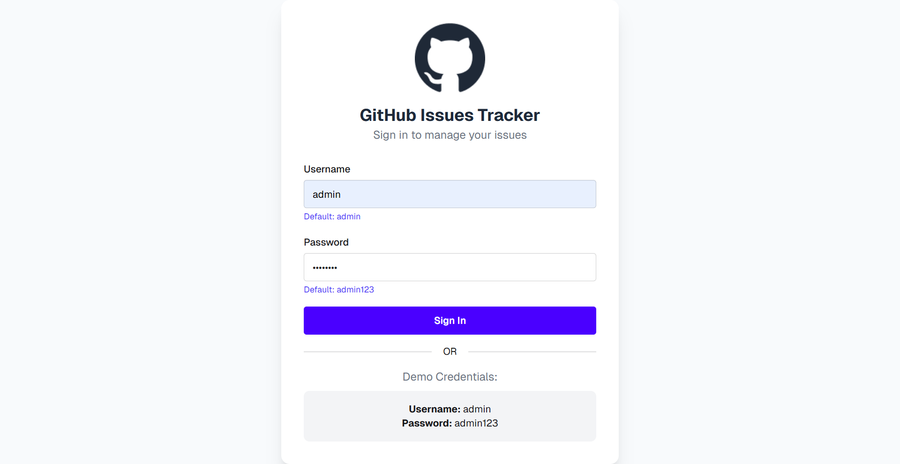
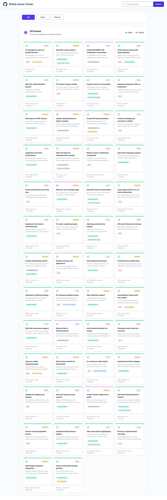

<div align="center">

# 🛠️ GitHub Issue Tracker
### *Efficient Tracking. Seamless Management. Faster Resolution.*

[]()
[]()
[]()
[]()
[]()

*A comprehensive GitHub Issue Tracker system with secure authentication, dynamic status-based UI, and real-time issue management. Built with a focus on clean logic and responsive dashboard design.*

</div>

---

### 📸 Project Previews
<p align="center">
  
  
</p>
<p align="center"><i>(Login View & Main Dashboard View)</i></p>

---

### 📝 Project Overview
This project focuses on handling complex frontend logic, such as user authentication and dynamic data rendering. It provides a clean interface where issues are categorized by status with visual indicators for better clarity.

### ✨ Key Features
- **Secure Authentication:** Functional login system for authorized access.
- **Dynamic Issue Cards:** Status-based UI elements (e.g., border colors based on issue priority).
- **Responsive Dashboard:** Fully optimized for all screen sizes using Tailwind CSS.
- **Efficient Data Handling:** Clean JavaScript logic for managing issue lists and updates.
- **Modern UI:** Minimalist and professional look using custom Tailwind configurations.

### 🛠️ Technology Stack
- **HTML5:** For core application structure.
- **Tailwind CSS:** For custom, utility-first styling and responsiveness.
- **JavaScript (ES6+):** For authentication logic, routing, and dynamic DOM updates.

### 📦 Major Components
- `login-function`: Handles user credentials and access.
- `issue-tracker-dashboard`: Main interface for viewing and managing issues.
- `status-indicator`: Visual logic for differentiating issue states.

### 🚀 How to Run Locally
1. **Clone the repository:**
   ```bash
   git clone [https://github.com/fireflyurmi/github-issue-tracker.git](https://github.com/fireflyurmi/github-issue-tracker.git)
